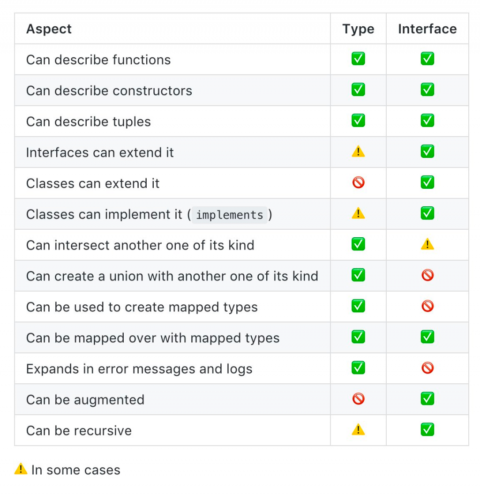

在TS中，什麼時候要用type什麼時候要用interface一直是大家在討論的，下面我會根據自己的習慣來說明我是如何使用

## Type 和 Interface分別如何寫和相似之處
```typescript
type A = {
  name: string
}
interface B {
  name: string;
}

type C = (a: number, b?: number) => number
interface D {
    (a: number, b?: number): number
}
```
從上面的範例來看， type和interface可以寫的很類似，且他們都具有相同的檢查機制

而type和interface在物件型別中，也都可以使用前面說過的選用屬性or唯獨屬性

## Type 和 Interface的差異
1. Interface只能表示物件型別，也就是要用到enum, tuple(但tuple又可以用interface實現）和原始型別時你會需要用到type
2. Interface可以被擴充(Interface Extension)和融合(Declaration Merging)，type不行
    ```typescript
    interface Personal {
      name: string
    }
    
    interface PersonalDetail {
      age: number;
    }
    
    interface PersonalDetail {
      gender: string;
    }
    
    interface PersonalData extends Personal, PersonalDetail {
      hoppy: string;
    }
    
    let x: PersonalData = {
      name: "Andy",
      age: 27,
      gender: "male",
      hoppy: "play game"
    }
    ```
    type可不可以有擴充功能是較為有爭議的，因為可以透過`複合型別`來達成效果，不過我自己是認為並不算是可以擴充。

3. Interface會創立一新名稱，但type不會
4. Interface可以實作，但type不行
    ```typescript
    interface Personal {
      name: string
    }
    
    class Person implements Personal {
      name: string;
      constructor(name: string) {
        this.name = name;
      }
    }
    ```
   
在網路上，應該還可以看到這張比較圖


但看完還是不知道他在幹嘛，下面直接在整理一次上面說的

1. 單純表示資料型別請用type，重復使用用interface
2. 原始型別、複合型別、tuple和enum用type宣告
3. 物件型別一律用interface宣告